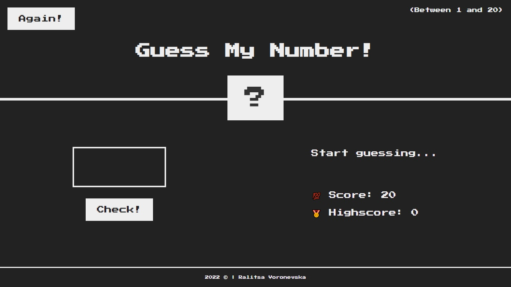
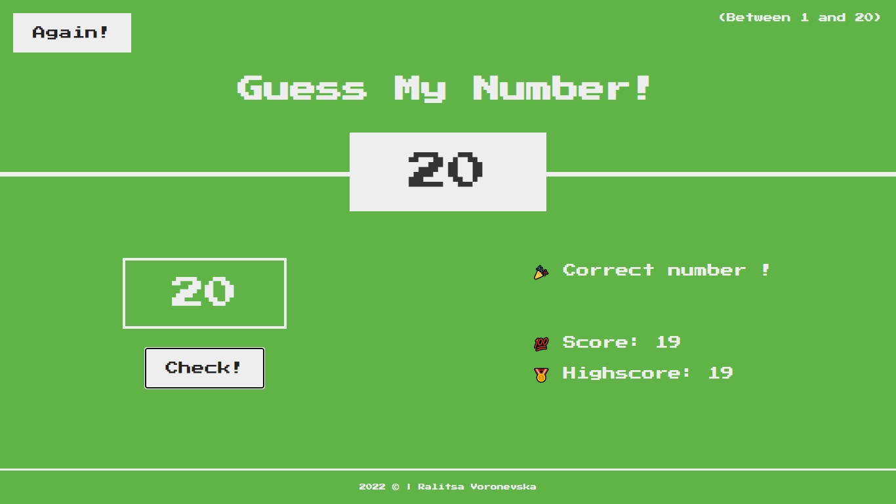
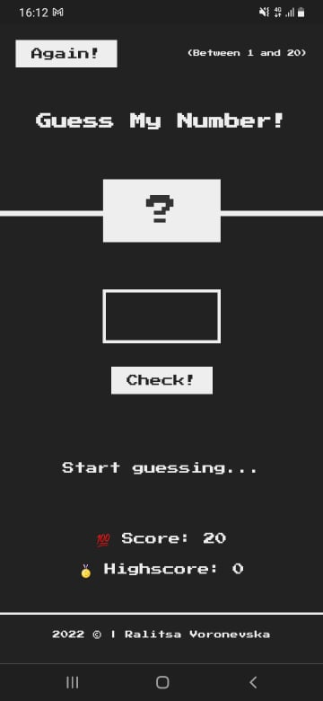
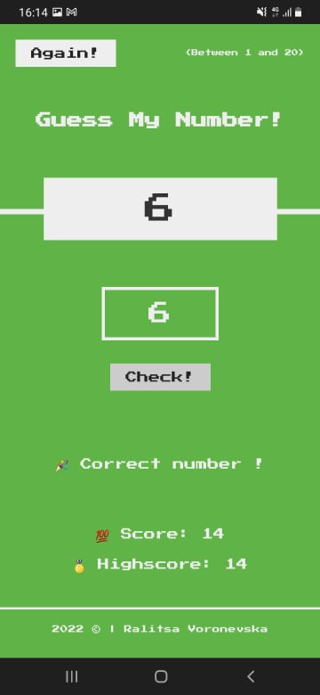

# Responsive Portfolio Website
[Live Preview](https://ralitsavoronevska.github.io/guess-my-number/)

# Desktop Preview:

# Tablet Landscape Preview:

<table>
  <tr>
    <td colspan="2">Tablet Portrait Preview</td>
  </tr>
  <tr>
    <td></td>
    <td></td>
  </tr>
 </table>

<table>
  <tr>
    <td colspan="2">Mobile Preview</td>
  </tr>
  <tr>
    <td></td>
    <td></td>
  </tr>
 </table>

# Built with:
* HTML5, CSS3, SASS, Vanilla JS

# Browser support:
(Last updated and tested: 24/01/2022)
* Chrome 97.0.4692.71 (Official Build) (64-bit)
* Firefox 77.0.1 (64-bit)
* Opera 68.0.3618.173
* IE Microsoft Edge 83.0.478.56 (Official build) (64-bit)

# Tools used:
* [W3C HTML Validator](https://validator.w3.org/)
* [W3C CSS Validator](https://jigsaw.w3.org/css-validator/)
* [LightHouse Audit](https://developers.google.com/web/tools/lighthouse/)
* [PageSpeed Insights Audit](https://developers.google.com/speed/pagespeed/insights/)

# Chrome LightHouse Audit

* Desktop & Mobile:

# PageSpeed Insights Results

* Desktop:

* Mobile:

